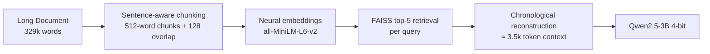

# DolphinMind
**Efficient long-context processing for small language models using semantic retrieval**

DolphinMind lets **1–7B parameter models** answer questions from **100k+ token documents** (450k+ tokens tested) with higher accuracy than native 64k (or even 128k) context windows while using **94.5% fewer tokens**.

## Key Results (Varney the Vampire – 329k words / ~453k tokens)

| Method                  | ROUGE-L ↑ | Tokens/Query ↓ | Approach                     |
|-------------------------|-----------|----------------|------------------------------|
| **DolphinMind**         | **0.185** | **3,500**      | Semantic RAG (top-5 chunks)  |
| SmolLM3 (64k native)    | 0.154     | 64,085         | Full context                 |
| RLM-Tools               | 0.154     | 2,100          | Tool-calling                 |
| Truncated (4k)          | 0.146     | 4,000          | Baseline                     |
| Naive Chunking + TF-IDF | 0.135     | 2,800          | Classic retrieval            |

**What we learned:** More context isn’t always better  
SmolLM3 @ 128k context → **0.132 ROUGE-L** (14% worse than 64k)

## How DolphinMind Works (4-stage pipeline)

Peak memory usage: ~5.8 GB (model + embeddings + FAISS index)

## Dataset

Varney the Vampire (1847 penny dreadful)
329,160 words ≈ 453k tokens
3 challenging plot & character questions
Human-written reference answers for ROUGE-L evaluation
