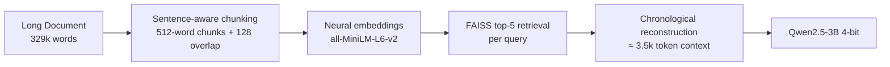

# DolphinMind
**Efficient long-context processing for small language models using semantic retrieval**

**DolphinMind** enables 1–7B models to reliably retrieve and reason over 100k+ token documents** (up to 450k+ tested) with higher accuracy than native 64k–128k windows while using ~90% fewer tokens.
## Key Results (Needle-in-a-Haystack Benchmark)
Classic “lost-in-the-middle” test with a single factual needle buried at 10%, 50%, or 90% depth in documents of 10k or 40k words.

| Method                  | Context Window | Accuracy | Tokens/Query | Notes                                    |
|-------------------------|----------------|----------|--------------|------------------------------------------|
| **DolphinMind (semantic)** | —            | **60.4%** | **3,500**    | **Best overall**                         |
| SmolLM3 (native)        | 64k            | 58.3%    | 28,220       | 8× more tokens, still slightly worse     |
| Truncated               | 4k             | 16.7%    | 4,000        | Classic baseline                         |
| SmolLM3 (native)        | 4k             | 10.4%    | 4,080        | Collapses completely                     |

**Statistical significance** (DolphinMind vs others, two-sample t-test):  
- vs Truncated (4k): **p < 0.0001**, Cohen’s d = 0.996 (very large effect)  
- vs SmolLM3 4k: **p < 0.0001**  
- vs SmolLM3 64k: **p = 0.837** (statistically indistinguishable but with 88% token savings!)

**Key observations from heatmaps & curves**  
- Truncated & SmolLM3 4k: **total collapse** beyond the first ~10% of the document  
- SmolLM3 64k: strong at extremes, **severe middle dip** (classic lost-in-the-middle)  
- **DolphinMind**: only method that stays robust in the middle (50% depth → 93.8% accuracy)

## How DolphinMind Works (4-stage pipeline)

Peak memory usage: ~5.8 GB (model + embeddings + FAISS index)
